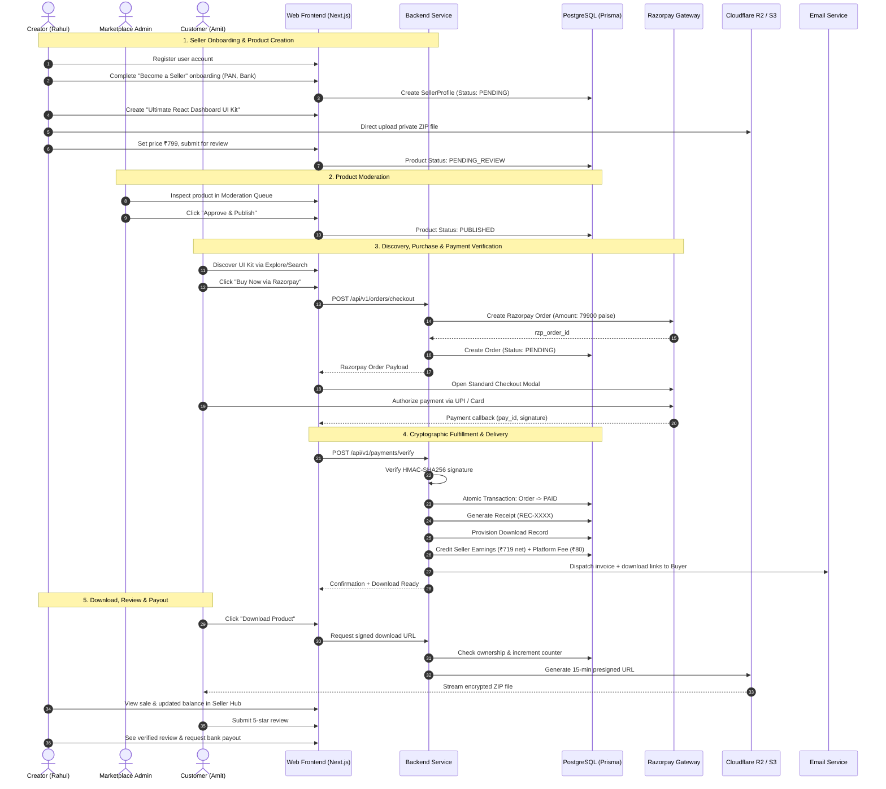

# Digital Marketplace — Master System Architecture & Implementation Blueprint

## 1. Executive Summary

**Digital Marketplace** is a multi-vendor digital e-commerce platform tailored for creators, developers, designers, and educators. It unifies:
- **Gumroad's** frictionless creator-first selling and digital delivery
- **Creative Market & Envato's** storefronts, rich catalog discovery, and licensing
- **Razorpay's** premier Indian payment rails (UPI, QR, Cards, Net Banking)
- **Zero-trust security** for digital file distribution (private cloud storage, authenticated signed URLs, automated invoice generation)

---

## 2. The 24-Step "Definition of Done" Transaction Loop

The platform is considered MVP-complete when this exact 24-step real-world transaction executes reliably without manual intervention:



---

## 3. High-Level Technology Architecture

```text
┌────────────────────────────────────────────────────────────────────────┐
│                        CLIENT LAYER (Next.js 14+)                      │
│   • App Router (Server Components + Client Interactivity)              │
│   • Tailwind CSS Design System (Sleek Dark Mode & Modern Typography)    │
│   • Razorpay Checkout Standard SDK (UPI / Cards / Net Banking)         │
└───────────────────────────────────┬────────────────────────────────────┘
                                    │ HTTPS (REST API)
┌───────────────────────────────────▼────────────────────────────────────┐
│                       SERVER LAYER (Node / Next.js)                    │
│   • Authentication & RBAC Middleware (JWT / NextAuth)                  │
│   • Catalog & Search Service                                           │
│   • Order & Razorpay Payment State Machine                             │
│   • Download Authorization & Token Engine                              │
│   • Seller Financial Ledger & Earnings Calculator                      │
│   • Admin Moderation Controller                                        │
└──────────────┬────────────────────┬────────────────────┬───────────────┘
               │                    │                    │
┌──────────────▼─────┐   ┌──────────▼─────────┐   ┌──────▼───────────────┐
│   DATABASE LAYER   │   │  PAYMENT GATEWAY   │   │   OBJECT STORAGE     │
│   PostgreSQL +     │   │     Razorpay       │   │ AWS S3 / Cloudflare  │
│   Prisma ORM       │   │ Orders, Webhooks,  │   │ R2 (Private bucket   │
│   Strict ACID &    │   │ Refunds, Route     │   │ for downloadable     │
│   Row-level Locks  │   │ Payouts            │   │ creator assets)      │
└────────────────────┘   └────────────────────┘   └──────────────────────┘
```

---

## 4. Secure File Distribution Model

1. **Private Bucket Storage**: Creator product files (`.zip`, `.pdf`, `.fig`, etc.) are uploaded strictly to a non-public bucket (`marketplace-private-assets`). Raw URLs are never exposed.
2. **Presigned Direct Uploads**: Sellers upload files directly from the browser to cloud storage using temporary AWS S3 / Cloudflare R2 presigned PUT URLs. This prevents large 500MB+ files from saturating API server memory.
3. **Download Authentication**: When a buyer clicks "Download", the API verifies:
   - Order exists and has status `PAID`.
   - Buyer ID matches the authenticated user session.
   - Download limit is not exhausted (abuse protection).
4. **Time-Limited Signed URLs**: The backend issues an expiring presigned GET URL (15-minute TTL) with the `Content-Disposition: attachment; filename="..."` header.
5. **Audit Logging**: Every download logs timestamp, IP address, and user agent to monitor potential sharing or abuse.

---

## 5. Project Directory Structure

```text
Digital E-Commerce/
├── docs/
│   ├── ARCHITECTURE_BLUEPRINT.md     # This comprehensive master plan
│   ├── schema.prisma                 # Complete Prisma database schema
│   ├── ROUTES_AND_SCREENS.md         # Full page & UI breakdown
│   ├── API_CONTRACT.md               # REST API endpoints & payloads
│   ├── PAYMENT_STATE_MACHINE.md      # Razorpay lifecycle & math
│   └── ROLE_PERMISSION_MATRIX.md     # Unified identity & RBAC
│
├── prisma/
│   ├── schema.prisma                 # Active Prisma configuration
│   └── seed.ts                       # Test seeds (Categories, Demo Products)
│
├── src/
│   ├── app/                          # Next.js 14 App Router
│   │   ├── (public)/                 # Landing, Explore, Categories, Product, Store
│   │   ├── (auth)/                   # Login, Signup, Verify, Reset Password
│   │   ├── (checkout)/               # Order summary, Razorpay modal wrapper, Success
│   │   ├── dashboard/                # Buyer Library, Orders, Wishlist, Profile
│   │   ├── become-seller/            # 4-step Creator onboarding wizard
│   │   ├── seller/                   # Seller Workspace (Products, Orders, Earnings)
│   │   ├── admin/                    # Operations Panel (Moderation, Users, Refunds)
│   │   └── api/                      # REST API route handlers
│   │       ├── v1/auth/
│   │       ├── v1/products/
│   │       ├── v1/orders/
│   │       ├── v1/payments/          # Verify & Webhook handlers
│   │       ├── v1/downloads/
│   │       ├── v1/seller/
│   │       └── v1/admin/
│   │
│   ├── components/                   # UI Component library
│   │   ├── ui/                       # Buttons, Cards, Inputs, Modals, Badges
│   │   ├── marketplace/              # ProductCard, CategoryPills, FilterSidebar
│   │   ├── checkout/                 # RazorpayButton, OrderSummary, ReceiptView
│   │   ├── seller/                   # RevenueChart, FileUploader, EarningsTable
│   │   └── admin/                    # ModerationCard, StatusDropdown, KPIWidget
│   │
│   ├── lib/                          # Core utilities & SDK wrappers
│   │   ├── prisma.ts                 # Prisma singleton instance
│   │   ├── razorpay.ts               # Razorpay SDK initialization & helpers
│   │   ├── storage.ts                # S3 / R2 presigned URL generator
│   │   ├── auth.ts                   # Session & JWT token verification
│   │   └── email.ts                  # Transactional email templates & mailer
│   │
│   └── types/                        # TypeScript definitions & API schemas
│
├── public/                           # Static brand assets & default illustrations
├── .env.example                      # Environment variables template
├── package.json                      # Dependencies & scripts
├── tailwind.config.ts                # Design tokens & color system
└── tsconfig.json                     # TypeScript strict configuration
```

---

## 6. MVP P0 Implementation Sequence

1. **Database & ORM Layer**: Set up PostgreSQL connection, migrate `schema.prisma`, seed primary categories (Development, Design, AI, Education, Productivity, Media, Software).
2. **Design System & Public Views**: Implement responsive layout with modern typography, navbar, landing page hero, category browser, and product detail screens.
3. **Identity & RBAC**: Authentication (Signup/Login/Session), role guards, and "Become a Seller" onboarding flow.
4. **Product Creation & Direct File Storage**: 4-step seller product creation wizard, direct private file upload, and admin moderation workbench.
5. **Razorpay Checkout & Cryptographic Verification**: Standard checkout integration, HMAC-SHA256 signature verification, webhook handler, and automated receipt generation.
6. **Secure Digital Vault & Delivery**: "My Library" buyer dashboard, signed download URL generation, and download count tracking.
7. **Creator Earnings & Payout Ledger**: Automated 10% platform fee calculation, pending balance ledger, and payout requests.
