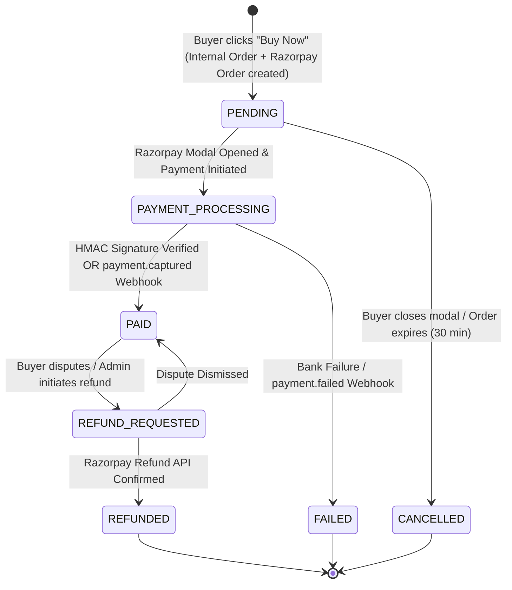

# Digital Marketplace — Razorpay Payment State Machine & Financial Architecture

## 1. State Machine Overview

The marketplace implements a strict dual-channel verification state machine. Product access and seller ledger credits are **only executed upon verified cryptographic proof** (client HMAC-SHA256 signature or authenticated Razorpay webhook).



---

## 2. State Definitions & Invariants

| State | Invariant / Condition | User Access | Seller Ledger |
|---|---|---|---|
| `PENDING` | Order created in DB with unique `razorpayOrderId`. Awaiting customer interaction. | No access | Unchanged |
| `PAYMENT_PROCESSING` | Payment attempt initiated on Razorpay modal. Webhook or callback pending. | No access | Unchanged |
| `PAID` | Cryptographically verified via HMAC signature or `payment.captured` webhook. | **Full Download Access & Receipt Unlocked** | **Net Earnings Credited** (Pending clearance) |
| `FAILED` | Gateway or bank returned failure error code. | No access | Unchanged |
| `CANCELLED` | Order timed out or customer explicitly dismissed payment modal. | No access | Unchanged |
| `REFUNDED` | Full payment returned via Razorpay Refund API. | **Download Access Revoked** | **Earnings Reversed** (Negative adjustment) |

---

## 3. Cryptographic Verification & Dual-Channel Reconciliation

To prevent fraud (e.g. tampering with client-side responses or network drops during callback), we support **dual verification**:

### Channel 1: Client-Side Callback (`POST /api/v1/payments/verify`)
1. Frontend receives Razorpay response:
   - `razorpay_order_id`
   - `razorpay_payment_id`
   - `razorpay_signature`
2. Backend computes expected signature:
   ```javascript
   const crypto = require('crypto');
   const body = razorpay_order_id + "|" + razorpay_payment_id;
   const expectedSignature = crypto
     .createHmac('sha256', process.env.RAZORPAY_KEY_SECRET)
     .update(body.toString())
     .digest('hex');
   ```
3. If `expectedSignature === razorpay_signature`:
   - Run **Idempotent Order Fulfillment Transaction** (Section 4).
   - Return `{ success: true, downloadReady: true }` to instant redirect buyer.

### Channel 2: Server-to-Server Webhook (`POST /api/v1/payments/webhook`)
1. Razorpay dispatches `payment.captured` or `order.paid` directly to `/api/v1/payments/webhook`.
2. Backend validates `x-razorpay-signature` against webhook payload:
   ```javascript
   const webhookSignature = req.headers['x-razorpay-signature'];
   const isWebhookValid = Razorpay.validateWebhookSignature(
     req.rawBody,
     webhookSignature,
     process.env.RAZORPAY_WEBHOOK_SECRET
   );
   ```
3. If valid, runs the identical **Idempotent Order Fulfillment Transaction**.
   - If the order was already marked `PAID` by Channel 1, the transaction safely no-ops.
   - If Channel 1 failed (e.g., user closed browser before redirect), Channel 2 ensures the customer gets their purchase and receipt automatically!

---

## 4. Idempotent Order Fulfillment Transaction

All fulfillment actions execute within a single atomic database transaction (`prisma.$transaction`):

```sql
-- Step 1: Lock order record to guarantee single execution
SELECT * FROM "Order" WHERE "id" = :orderId FOR UPDATE;

-- Step 2: Guard check
-- IF status == 'PAID', RETURN ALREADY_FULFILLED;

-- Step 3: Update Order State
UPDATE "Order" SET 
  "status" = 'PAID', 
  "paidAt" = NOW(), 
  "razorpayPaymentId" = :paymentId, 
  "razorpaySignature" = :signature
WHERE "id" = :orderId;

-- Step 4: Record Payment details
INSERT INTO "Payment" ("id", "orderId", "razorpayOrderId", "razorpayPaymentId", "amountPaise", "status", "method")
VALUES (:paymentId, :orderId, :rzpOrderId, :rzpPaymentId, :amount, 'CAPTURED', :method);

-- Step 5: Generate Official Invoice / Receipt
INSERT INTO "Receipt" ("id", "orderId", "invoiceNumber", "amountPaidPaise", "paymentMethod", "paymentId")
VALUES (:receiptId, :orderId, :invoiceNum, :amount, :method, :rzpPaymentId);

-- Step 6: Provision Secure Digital Downloads
INSERT INTO "Download" ("id", "orderId", "buyerId", "productFileId", "isActive")
SELECT gen_random_uuid(), :orderId, :buyerId, pf.id, true
FROM "ProductFile" pf WHERE pf."productId" = :productId;

-- Step 7: Record Seller Net Earning Entry
INSERT INTO "SellerEarning" ("id", "sellerId", "orderId", "grossAmountPaise", "platformFeePaise", "netEarningsPaise", "status", "availableOn")
VALUES (gen_random_uuid(), :sellerId, :orderId, :grossAmount, :platformFee, :netEarnings, 'PENDING', NOW() + INTERVAL '7 days');

-- Step 8: Update Seller Profile Aggregates
UPDATE "SellerProfile" SET 
  "totalRevenuePaise" = "totalRevenuePaise" + :grossAmount,
  "netEarningsPaise" = "netEarningsPaise" + :netEarnings,
  "pendingBalance" = "pendingBalance" + :netEarnings
WHERE "id" = :sellerId;
```

---

## 5. Financial Math & Ledger Formula

For every transaction:
```text
Gross Sale Amount (A)    = ₹799.00 (79,900 Paise)
Platform Commission (10%)= ₹79.90  (7,990 Paise)
Net Seller Share (90%)   = ₹719.10 (71,910 Paise)

Formula:
platformFeePaise    = Math.round(totalAmountPaise * 0.10)
sellerEarningsPaise = totalAmountPaise - platformFeePaise
```

### Refund Handling
When an admin approves a refund:
1. Calls Razorpay API: `razorpay.payments.refund(paymentId, { amount: amountPaise })`.
2. Marks `Order.status = REFUNDED`.
3. Sets `Download.isActive = false` (immediately revokes download link validity).
4. Creates negative ledger entry in `SellerEarning` (`netEarningsPaise = -sellerEarningsPaise`) and deducts from `SellerProfile.pendingBalance`.
5. Sends notification to both Buyer and Seller.
